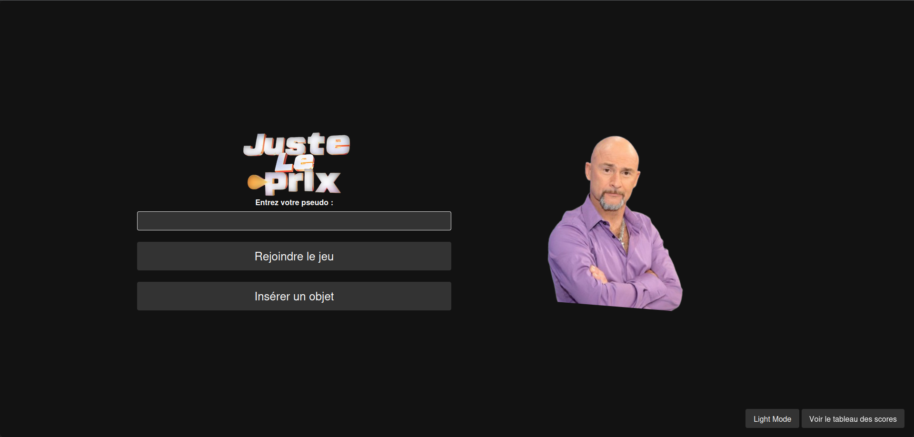

# GROUPE EKIP

## Membres :
- Axel Rivière (__*Scrum Master*__)
- Bylel Bourhim
- Quentin Tripognez
- Clément Markwitz

## Manuel d'utilisation
- Pour lancer l'application, il suffit de lancer le fichier `app.py`.

- Vous attérissez sur une page d'accueil où vous aurez la possibilité de jouer ou d'insérer un produit
  - Si souhaitez jouer, vous devez renseigner votre pseudo et cliquer sur le bouton "Jouer"
  - Si vous souhaitez insérer un produit, vous devez cliquer sur le bouton "Insérer" qui vous redirigera vers une page dédiée.

- Vous avez également la possibilité, à travers les boutons en bas à droite, de changer le mode clair/sombre ainsi que de consulter le tableau des scores.

## Product backlog
* Base de données pour les produits avec 5 attributs :
  - code (clé primaire)
  - image 
  - nom
  - prix
  - thème

* Base de donnee pour les logs de joueurs avec 4 attributs :
  - identifiant (clé primaire)
  - pseudo
  - score
  - code du produit deviné (clé étrangère)

* Programmes qui gérent la base de données (création, insertion, séléction)

* Page web de jeu qui affiche une image et un champ texte pour deviner le prix du produit

* Page web pour insérer des produits dans la base de données

* Page web pour afficher les scores (nombre de tentative) dans l'ordre croissant 

* Programme principal qui gère les différentes routes de l'application

## Features
- Mode clair/sombre
- Page d'accueil
- Page d'insertion de produit
- Page d'affichage des scores
- Thèmes de produits
- Bruitage

## Répartition des tâches
| Tâche                                                | Responsable(s)                   |
|------------------------------------------------------|----------------------------------|
| Conception de la base de données                     | Clément Markwitz & Bylel Bourhim |
| Implémentation des requêtes à l'API                  | Axel Rivière                     |
| Développement du programme principal                 | Axel Rivière & Bylel Bourhim     |
| Réalisation de la page d'insertion de produit (back) | Axel Rivière                     | 
| Réalisation de la page des scores (back)             | Clément Markwitz                 |
| Gestion du front sur l'ensemble de l'application     | Quentin Tripognez                |

## Screenshots de l'application

| Light Mode                                             | Dark Mode                                             |
|--------------------------------------------------------|-------------------------------------------------------|
|  |  |
|        |        |
|      |      |
|        |        |
|  |  |
|  |  |
|  |  |

## Screenshots GitLab
### Workflow : *Feature Branch Workflow*
| Issues                                                | Milestones                                             |
|-------------------------------------------------------|--------------------------------------------------------|
|                    |             |

